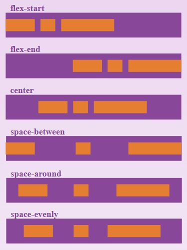
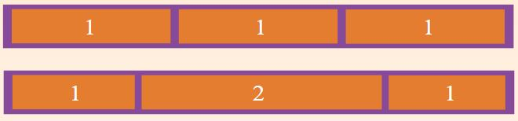
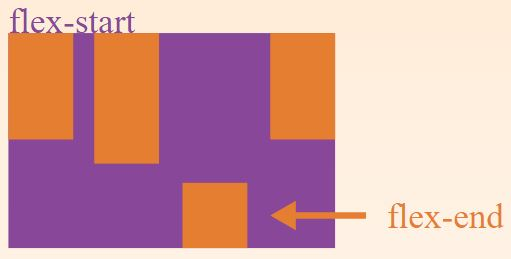

# FlexBox

Flexbox is the commonly-used name for the CSS Flexible Box Layout Module, a layout model for displaying items in a single dimension — as a row or as a column.

In the specification, flexbox is described as a layout model for user interface design. The key feature of flexbox is the fact that items in a flex layout can grow and shrink. Space can be assigned to the items themselves, or distributed between or around the items.

Flexbox also enables alignment of items on the main or cross axis, thus providing a high level of control over the size and alignment of a group of items.

## Properties of the parent (flex container)

### flex-direction

This establishes the main-axis, thus defining the direction flex items are placed in the flex container. Flexbox is (aside from optional wrapping) a single-direction layout concept. Think of flex items as primarily laying out either in horizontal rows or vertical columns.

```css
.container {
  flex-direction: row | row-reverse | column | column-reverse;
}
```

+ `row` (default): left to right in `ltr`; right to left in `rtl`
+ `row-reverse`: right to left in `ltr`; right to left in `rtl`
+ `column`: same as `row ` but top to bottom
+ `column-reverse`: same as `row-reverse` but bottom to top

### flex-wrap

By default, flex items will all try to fit onto one line.  You can change that and allow the items to wrap as needed with this property.

```css
.container{
  flex-wrap: nowrap | wrap | wrap-reverse;
}
```

+ `nowrap` (default): all flex items will be on one line
+ `wrap`: flex items will wrap onto multiple lines, from top to bottom
+ `wrap-reverse`: flex items will wrap onto multiple lines from bottom to top

### flex-flow

This is a shorthand `flex-direction` and `flex-wrap` properties, which together define the flex-container's main and cross axes.  Default is `row nowrap`.

```
flex-flow: <‘flex-direction’> || <‘flex-wrap’>
```

### justify-content

This defines the alignment along the main axis.  It helps distribute extra free space left over when either all the flex items on a line are inflexible, or are flexible but have reached their maximum size.  It also exerts some control over the alignment of items when they overflow the line.



```css
.container {
  justify-content: flex-start | flex-end | center | space-between | space-around | space-evenly;
}
```

+ `flex-start` (default): items are packed toward the start line
+ `flex-end`: items are packed toward the end line
+ `center`: items are centered along the line
+ `space-between`: items are evenly distributed in the line: first item is on the start line, last item on the end line
+ `space-around`: items are evenly distributed in the line with equal space around them. Note that visually the spaces aren't equal, since all the items have equal space on both sides. The first item will have one unit of space against the container edge, but two untis of space between the next item because that next item has its own spacing that applies.
+ `space-evenly`: items are distributed so that the spacing between any two items (and the space to the edges) is equal.

### align-items

This defines the default behaviour for how flex items are laid out along the cross axis on the current line.  Think of it as the `justify-content` version for the cross axis (perpendicular to the main-axis).


```css
.container {
  align-items: flex-start | flex-end | center | baseline | stretch;
}
```

+ `flex-start`: cross-start margin edge of the items is placed on the cross-start line
+ `flex-end`: cross-end margin edge of the items is placed on the cross-end line
+ `center`: items are centered in the cross axis
+ `baseline`: items are aligned such as their baselines align
+ `stretch`(default): stretch to fill the container (still respect min-width/max-width)

### align-content

This aligns a flex container's lines within when there is extra space in the cross-axis, similar to how `justify-content` aligns individual items within the main-axis.

**Note**: This property has no effect when there is only one line of flex items.


```css
.container {
  align-content: flex-start | flex-end | center | space-between | space-around | stretch;
}
```

+ `flex-start`: lines packed to the start of the container
+ `flex-end`: lines packed to the end of the container
+ `center`: lines packed to the center of the container
+ `space-between`: lines evenly distributed; the first line is at the start of the container while the last one is at the end.
+ `space-around`: lines evenly distributed with equal space around each line
+ `stretch` (default): lines stretch to take up the remaining space

## Properties for the Children (flex items)

### order

By default, flex items are laid out in the source order. However, the `order` property controls the order in which they appear in the flex container.

```css
.item {
  order: <integer>; /* default is 0 */
}
```

### flex-grow

This defines the ability for a flex item to grow if necessary. It accepts a unitless value that serves as a proportion. It dictates what amount of the available space inside the flex container item should take up.

If all items have `flex-grow` set to 1, the remaining space in the container will be distributed equally to all children.  If one of the children has a value of 2, the remaining space would take up twice as much space as the others (or it will try to, at least).



```css
.item {
  flex-grow: <number>; /* default 0 */
}
```

### flex-shrink

This defines the ability for a flex item to shrink if necessary.  Negative numbers are invalid.

```css
.item {
  flex-shrink: <number>; /* default 1 */
}
```

### flex-basis

This defines the default size of an element before the remaining space is distributed. It can be a length (e.g. 20%, 5rem, etc.) or a keyword. The `auto` keyword means "look at my width or height property" (which was temporarily done by the `main-size` keyword until deprecated). The `content` keyword means "size it based on the item's content" - this keyword isn't well supported yet, so it's hard to test and harder to know what its brethren `max-content`, `min-content`, and `fit-content` do.

```css
.item {
  flex-basis: <length> | auto; /* default auto */
}
```

If set to `0`, the extra space around content isn't factored in. If set to `auto`, the extra space is distributed based on its `flex-grow` value.

### flex

This is the shorthand for `flex-grow`, `flex-shrink`, and `flex-basis` combined.  The second and third parameters (`flex-shrink` and `flex-basis`) are optional.  Default is `0 1 auto`.

```css
.item {
  flex: none | [ <'flex-grow'> <'flex-shrink'>? || <'flex-basis'> ]
}
```

It is recommended that you use this shorthand property rather than set the individual properties. The short hand sets the other values intelligently.

### align-self

This allows the default alignment (or the one specified by `align-items`) to be overridden for individual flex items.

Please see the align-items explanation to understand the available values.



```css
.item {
  align-self: auto | flex-start | flex-end | center | baseline | stretch;
}
```

Note that `float`, `clear` and `vertical-align` have no effect on a flex item.

###