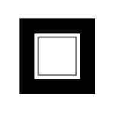
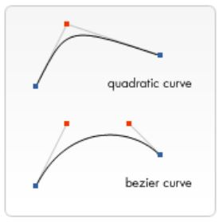

# HTML `<canvas>` element

Added in HTML5, the HTML `<canvas>` element can be used to draw graphics via scripting in JavaScript. For example, it can be used to draw graphs, make photo compositions, create animations, or even do real-time video processing or rendering.

Mozilla applications gained support for `<canvas>` starting with Gecko 1.8 (i.e. Firefox 1.5). The element was originally introduced by Apple for the OS X Dashboard and Safari. Internet Explorer supports `<canvas>` from version 9 onwards; for earlier versions of IE, a page can effectively add support for `<canvas>` by including a script from Google's Explorer Canvas project. Google Chrome and Opera 9 also support `<canvas>`.

The `<canvas>` element is also used by WebGL to draw hardware-accelerated 3D graphics on web pages.

## Basic Usage

At first sight a `<canvas>` looks like the `` element, with the only clear difference being that it doesn't have the `src` and `alt` attributes. Indeed, the `<canvas>` element has only two attributes (other than `id` and other commonly shared elements), `width` and `height`. These are both optional and can also be set using DOM properties. When no `width` and `height` attributes are specified, the canvas will initially be 300 pixels wide and 150 pixels high. The element can be sized arbitrarily by CSS, but during rendering the image is scaled to fit its layout size: if the CSS sizing doesn't respect the ratio of the initial canvas, it will appear distorted.

The `<canvas>` element can be styled just like any normal image (`margin`, `border`, `background`...). These rules, however, don't affect the actual drawing on the canvas. When no styling rules are applied to the canvas it will initially be fully transparent.

### Fallback Content

Providing fallback content is very straightforward: just insert the alternate content inside the `<canvas>` element. Browsers that don't support `<canvas>` will ignore the container and render the fallback content inside it. Browsers that do support `<canvas>` will ignore the content inside the container, and just render the canvas normally.

For example, we could provide a text description of the canvas content or provide a static image of the dynamically rendered content. This can look something like this:

```html
<canvas id="stockGraph" width="150" height="150">
  current stock price: $3.15 + 0.15
</canvas>

<canvas id="clock" width="150" height="150">
  
</canvas>
```

### The Rendering Context

The `<canvas>` element creates a fixed-size drawing surface that exposes one or more rendering contexts, which are used to create and manipulate the content shown.

The canvas is initially blank. To display something, a script first needs to access the rendering context and draw on it. The `<canvas>` element has a method called `getContext()`, used to obtain the rendering context and its drawing functions. `getContext()` takes one parameter, the type of context. For 2D graphics, you specify "2d" to get a `CanvasRenderingContext2D`

```js
var canvas = document.getElementById('tutorial');
var ctx = canvas.getContext('2d');
```

The first line in the script retrieves the node in the DOM representing the `<canvas>` element by calling the `document.getElementById()` method. Once you have the element node, you can access the drawing context using its `getContext()` method.

### Checking for support

The fallback content is displayed in browsers which do not support `<canvas>`. Scripts can also check for support programmatically by simply testing for the presence of the `getContext()` method. Our code snippet from above becomes something like this:

```js
var canvas = document.getElementById('tutorial');

if (canvas.getContext) {
  var ctx = canvas.getContext('2d');
  // drawing code here
} else {
  // canvas-unsupported code here
}
```

## Drawing Shapes with `<canvas>`

### The Grid

Normally 1 unit in the grid corresponds to 1 pixel on the canvas. The origin of this grid is positioned in the top left corner at coordinate (0,0). All elements are placed relative to this origin. So the position of the top left corner of the blue square becomes x pixels from the left and y pixels from the top, at coordinate (x,y). we can translate the origin to a different position, rotate the grid and even scale it, but for now we'll stick to the default.

### Drawing Rectangles

Unlike SVG, `<canvas>` only supports one primitive shape: rectangles. All other shapes must be created by combining one or more paths, lists of points connected by lines. Luckily, we have an assortment of path drawing functions which make it possible to compose very complex shapes.

First let's look at the rectangle. There are three functions that draw rectangles on the canvas:

+ `fillRect(x, y, width, height)` : Draws a filled rectangle.
+ `strokeRect(x, y, width, height)`: Draws a rectangular outline.
+ `clearRect(x, y, width, height)`: Clears the specified rectangular area, making it fully transparent.

```js
function draw() {
  var canvas = document.getElementById('canvas');
  if (canvas.getContext) {
    var ctx = canvas.getContext('2d');

    ctx.fillRect(25, 25, 100, 100);
    ctx.clearRect(45, 45, 60, 60);
    ctx.strokeRect(50, 50, 50, 50);
  }
}
```


Unlike path functions, all three rectangle functions draw immediately to the canvas.

Additionally you can use `rect(x, y, width, height)` which adds a rectangular path to a currently open path.

### Drawing Paths

The only other primitive shapes are paths. A path is a list of points, connected by segments of lines that can be of different shapes, curved or not, of different width and of different color. A path, or even a subpath, can be closed. To make shapes using paths takes some extra steps:

1. First, you create the path.
2. Then you use drawing commands to draw into the path.
3. Once the path has been created, you can stroke or fill the path to render it.

Here are the functions used to perform these steps:

+ `beginPath()`: Creates a new path. Once created, future drawing commands are directed into the path and used to build the path up.
+ `Path Methods`: Methods to set different paths for objects.
+ `closePath`: Adds a straight line to the path, going to the start of the current sub-path.
+ `stroke()`: Draws the shape by stroking its outline.
+ `fill()`: Draws a solid shape by filling the path's content area.

The first step to create a path is to call the `beginPath()`. Internally, paths are stored as a list of sub-paths (lines, arcs, etc) which together form a shape. Every time this method is called, the list is reset and we can start drawing new shapes.

>When the current path is empty, such as immediately after calling `beginPath()`, or on a newly created canvas, the first path construction command is always treated as a `moveTo()`, regardless of what it actually is. For that reason, you will almost always want to specifically set your starting position after resetting a path.

The second step is calling the methods that actually specify the paths to be drawn. This is the bulk of the work and will be discussed in a bit.

Finally, the third OPTIONAL step is to call `closePath()`. This method tries to close the shape by drawing a straight line from the current point to the start.

> When you call `fill()`, any open shapes are closed automatically, so you don't have to call `closePath()`. This is not the case when you call `stroke()`.

Basic example, drawing a triangle:

```js
function draw() {
  var canvas = document.getElementById('canvas');
  if (canvas.getContext) {
    var ctx = canvas.getContext('2d');

    ctx.beginPath();
    ctx.moveTo(75, 50);
    ctx.lineTo(100, 75);
    ctx.lineTo(100, 25);
    ctx.fill();
  }
}
```

#### Moving the Pen

When the canvas is initialized or `beginPath()` is called, you typically will want to use the `moveTo()` function to place the starting point somewhere else. We could also use `moveTo()` to draw unconnected paths. You can probably best think of this as lifting a pen or pencil from one spot on a piece of paper and placing it on the next.

`moveTo(x,y)`: Moves the pen to the coordinates specified by `x` and `y`.

#### Lines and Arcs

+ `lineTo(x,y)`:Draws a line from the current drawing position to the position specified by `x` and `y`.
+ `arc(x, y, radius, startAngle, endAngle, anticlockwise)`: Draws an arc which is centered at (`x`, `y`) position with `radius` starting at `startAngle` and ending at `endAngle` going in the given direction indicated by `anticlockwise` (defaulting to `false` to indicate clockwise).
+ `arcTo(x1, y1, x2, y2, radius)`: Draws an arc with the given control points and radius, connected to the previous point by a straight line.

>Angles in the arc function are measured in radians, not degrees. To convert degrees to radians you can use the following JavaScript expression: `radians = (Math.PI/180)*degrees`.

#### Bezier and Quadratic Curves

+ `quadraticCurveTo(cp1x, cp1y, x, y)`: Draws a quadratic Bézier curve from the current pen position to the end point specified by `x` and `y`, using the control point specified by `cp1x` and `cp1y`.
+ `bezierCurveTo(cp1x, cp1y, cp2x, cp2y, x, y)`: Draws a cubic Bézier curve from the current pen position to the end point specified by `x` and `y`, using the control points specified by (`cp1x`, `cp1y`) and (`cp2x`, `cp2y`).

A quadratic Bézier curve has a start and an end point (blue dots) and just one control point (indicated by the red dot) while a cubic Bézier curve uses two control points.



The `x` and `y` parameters in both of these methods are the coordinates of the end point. `cp1x` and `cp1y` are the coordinates of the first control point, and `cp2x` and `cp2y` are the coordinates of the second control point.

### Path2d and SVG

The `Path2D()` constructor returns a newly instantiated Path2D object, optionally with another path as an argument (creates a copy), or optionally with a string consisting of SVG path data.

```js
new Path2D();     // empty path object
new Path2D(path); // copy from another Path2D object
new Path2D(d);    // path from SVG path data
```

All path methods like `moveTo`, `rect`, `arc` or `quadraticCurveTo`, etc., which we got to know above, are available on `Path2D` objects.

The Path2D API also adds a way to combine paths using the `addPath` method. This can be useful when you want to build objects from several components, for example.

`Path2D.addPath(path [, transform])`: Adds a path to the current path with an optional transformation matrix.

Example:

```js
function draw() {
  var canvas = document.getElementById('canvas');
  if (canvas.getContext) {
    var ctx = canvas.getContext('2d');

    var rectangle = new Path2D();
    rectangle.rect(10, 10, 50, 50);

    var circle = new Path2D();
    circle.moveTo(125, 35);
    circle.arc(100, 35, 25, 0, 2 * Math.PI);

    ctx.stroke(rectangle);
    ctx.fill(circle);
  }
}
```

Another powerful feature of the new canvas Path2D API is using SVG path data to initialize paths on your canvas. This might allow you to pass around path data and re-use them in both, SVG and canvas.

```js
var p = new Path2D('M10 10 h 80 v 80 h -80 Z');
```

## Styles and Color

### Color

If we want to apply colors to a shape, there are two important properties we can use: `fillStyle` and `strokeStyle`.

+ `fillStyle = color`: Sets the style used when filling shapes.
+ `strokeStyle = color`: Sets the style for shapes' outlines.

`color` is a string representing a CSS `<color>`, a gradient object, or a pattern object. We'll look at gradient and pattern objects later. By default, the stroke and fill color are set to black (CSS color value #000000).

> When you set the strokeStyle and/or fillStyle property, the new value becomes the default for all shapes being drawn from then on. For every shape you want in a different color, you will need to reassign the fillStyle or strokeStyle property.

### Transparency

`globalAlpha = transparencyValue`: Applies the specified transparency value to all future shapes drawn on the canvas. The value must be between 0.0 (fully transparent) to 1.0 (fully opaque). This value is 1.0 (fully opaque) by default.

```js
  // set transparency value
  ctx.globalAlpha = 0.2;
  ```

You can also just use RGBA on `strokeStyle` and `fillStyle` which is probably easier.

```js
// Assigning transparent colors to stroke and fill style

ctx.strokeStyle = 'rgba(255, 0, 0, 0.5)';
ctx.fillStyle = 'rgba(255, 0, 0, 0.5)';
```

### Line Styles

+ `lineWidth = value`: Sets the width of lines drawn in the future.
+ `lineCap = butt | round | square`: Sets the appearance of the ends of lines. 
+ `lineJoin = round | bevel | miter`: Sets the appearance of the "corners" where lines meet.
+ `miterLimit = value`: Establishes a limit on the miter when two lines join at a sharp angle, to let you control how thick the junction becomes.
+ `getLineDash()`: Returns the current line dash pattern array containing an even number of non-negative numbers.
+ `setLineDash(segments)`: Sets the current line dash pattern. Accepts a list of numbers that specifies distances to alternately draw a line and a gap.
+ `lineDashOffset = value`: Specifies where to start a dash array on a line.

### Gradients

Just like any normal drawing program, we can fill and stroke shapes using linear and radial gradients. We create a `CanvasGradient` object by using one of the following methods. We can then assign this object to the `fillStyle` or `strokeStyle` properties.

+ `createLinearGradient(x1, y1, x2, y2)`: Creates a linear gradient object with a starting point of (`x1`, `y1`) and an end point of (`x2`, `y2`).
+ `createRadialGradient(x1, y1, r1, x2, y2, r2)`: Creates a radial gradient. The parameters represent two circles, one with its center at (`x1`, `y1`) and a radius of `r1`, and the other with its center at (`x2`, `y2`) with a radius of `r2`.

```js
var lineargradient = ctx.createLinearGradient(0, 0, 150, 150);
var radialgradient = ctx.createRadialGradient(75, 75, 0, 75, 75, 100);
```

Once we've created a CanvasGradient object we can assign colors to it by using the `addColorStop()` method.

`gradient.addColorStop(position, color)`: Creates a new color stop on the gradient object. The position is a number between 0.0 and 1.0 and defines the relative position of the color in the gradient, and the color argument must be a string representing a CSS `<color>`, indicating the color the gradient should reach at that offset into the transition. You can add as many colorstops as you'd like.

```js
var lineargradient = ctx.createLinearGradient(0, 0, 150, 150);
lineargradient.addColorStop(0, 'white');
lineargradient.addColorStop(1, 'black');
```

### Patterns

`createPattern(image, type)`: Creates and returns a new canvas pattern object. `image` is a `CanvasImageSource` (that is, an `HTMLImageElement`, another canvas, a `<video>` element, or the like. `type` is a string indicating how to use the image.
The `type` specifies how to use the image in order to create the pattern, and must be one of the following string values:

+ `repeat`: Tiles the image in both vertical and horizontal directions.
+ `repeat-x`: Tiles the image horizontally but not vertically.
+ `repeat-y`: Tiles the image vertically but not horizontally.
+ `no-repeat`: Doesn't tile the image. It's used only once.

We use this method to create a `CanvasPattern` object which is very similar to the gradient methods we've seen above. Once we've created a pattern, we can assign it to the `fillStyle` or `strokeStyle` properties. For example:

```js
var img = new Image();
img.src = 'someimage.png';
var ptrn = ctx.createPattern(img, 'repeat');
```

Like with the `drawImage()` method, you must make sure the image you use is loaded before calling this method or the pattern may be drawn incorrectly.

```js
function draw() {
  var ctx = document.getElementById('canvas').getContext('2d');

  // create new image object to use as pattern
  var img = new Image();
  img.src = 'https://mdn.mozillademos.org/files/222/Canvas_createpattern.png';
  img.onload = function() {

    // create pattern
    var ptrn = ctx.createPattern(img, 'repeat');
    ctx.fillStyle = ptrn;
    ctx.fillRect(0, 0, 150, 150);

  }
}
```

### Shadows

+ `shadowOffsetX = float`: Indicates the horizontal distance the shadow should extend from the object. This value isn't affected by the transformation matrix. The default is 0.
+ `shadowOffsetY = float`: Indicates the vertical distance the shadow should extend from the object. This value isn't affected by the transformation matrix. The default is 0.
+ `shadowBlur = float`: Indicates the size of the blurring effect; this value doesn't correspond to a number of pixels and is not affected by the current transformation matrix. The default value is 0.
+ `shadowColor = color`: A standard CSS color value indicating the color of the shadow effect; by default, it is fully-transparent black.

The properties `shadowOffsetX` and `shadowOffsetY` indicate how far the shadow should extend from the object in the X and Y directions; these values aren't affected by the current transformation matrix. Use negative values to cause the shadow to extend up or to the left, and positive values to cause the shadow to extend down or to the right. These are both 0 by default.

The `shadowBlur` property indicates the size of the blurring effect; this value doesn't correspond to a number of pixels and is not affected by the current transformation matrix. The default value is 0.

The `shadowColor` property is a standard CSS color value indicating the color of the shadow effect; by default, it is fully-transparent black.

### Canvas Fill Rules

When using `fill` (or `clip` and `isPointinPath`) you can optionally provide a fill rule algorithm by which to determine if a point is inside or outside a path and thus if it gets filled or not. This is useful when a path intersects itself or is nested.

Two values are possible:

+ _"nonzero"_: The non-zero winding rule, which is the default rule.
+ _"evenodd"_: The even-odd winding rule.

```js
function draw() {
  var ctx = document.getElementById('canvas').getContext('2d'); 
  ctx.beginPath(); 
  ctx.arc(50, 50, 30, 0, Math.PI * 2, true);
  ctx.arc(50, 50, 15, 0, Math.PI * 2, true);
  ctx.fill('evenodd');
}
```